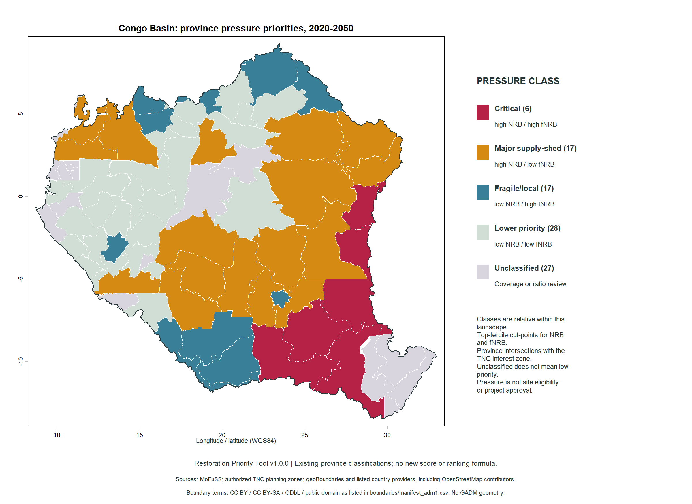
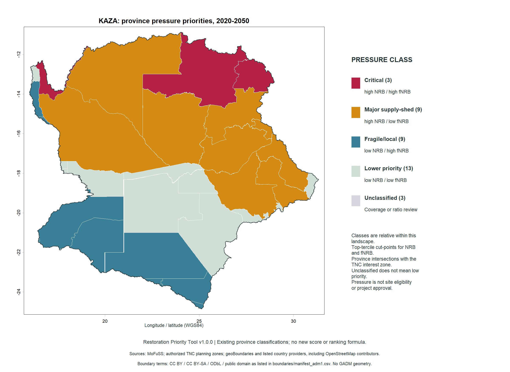

# Example outputs — v1.0.0

These maps display pressure priorities for province intersections with the supplied TNC zone of interest. They are not maps of approved restoration sites. Each landscape has its own top-tercile thresholds; class labels cannot be treated as identical absolute pressure across landscapes. Unclassified means evidence/coverage review, not low priority.

## Congo Basin

95 province intersections: 6 Critical, 17 Major supply-shed, 17 Fragile/local, 28 Lower priority and 27 unclassified. The delivered investigation shortlist contains the 23 Critical/Major supply-shed intersections. Other classes remain in the complete tables and GIS files.

## KAZA

37 province intersections: 3 Critical, 9 Major supply-shed, 9 Fragile/local, 13 Lower priority and 3 unclassified. The corresponding investigation shortlist contains 12 intersections.

The Zenodo bundle also contains full-resolution recovery, depletion and observed-change GeoTIFFs, two landscape recovery/depletion overview maps, climate and social-context maps, and unrounded tables. Read [the practical guide](TNC_QUICKSTART.md) before interpreting priorities. Native woody recovery is not permission to convert natural grasslands or open savannas.

Generated by `scripts/09_priority_brief.R` from the completed v1 results. Boundary data and adapted cartography retain applicable country-specific attribution/share-alike terms: see [third-party notices](../THIRD_PARTY_NOTICES.md) and the archived boundary metadata.
